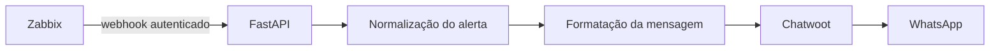
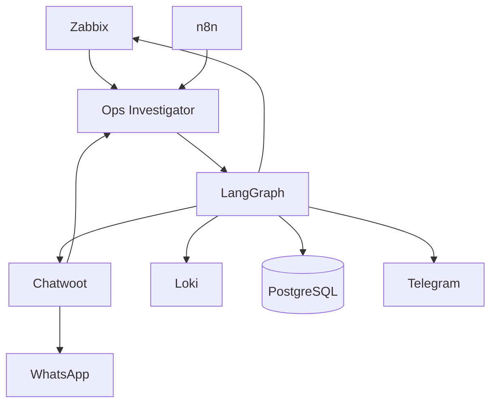

<!-- generated-by: gsd-doc-writer -->
# Ops Investigator

POC de um agente que investiga incidentes em uma plataforma de atendimento, reúne evidências operacionais e transforma alertas técnicos em notificações objetivas para o WhatsApp.


## Sobre o projeto

A plataforma observada usa Chatwoot e UAZAPI para integrar o WhatsApp, um bridge entre os serviços e um agente de atendimento executado no n8n. A observabilidade existente inclui Zabbix, Grafana Loki, Portainer e Coolify.

O objetivo do Ops Investigator é reduzir o tempo entre um problema ser detectado e uma pessoa entender:

- qual serviço foi afetado;
- quais evidências foram encontradas;
- qual é a causa provável;
- o que deve ser verificado em seguida.

O projeto é somente investigativo: ele não reinicia containers, executa comandos ou altera produção.

## Estado atual

A primeira fatia da POC está implementada:

- API FastAPI com health check;
- webhook autenticado para alertas do Zabbix;
- validação e normalização do payload com Pydantic;
- formatação de uma notificação operacional;
- envio para uma conversa do Chatwoot;
- modo seguro que processa alertas sem realizar envios externos;
- Dockerfile para empacotamento da aplicação;
- testes automatizados do health check e do webhook.

O LangGraph, a busca de logs no Loki, a persistência em PostgreSQL e a detecção de conversas sem resposta fazem parte dos próximos incrementos.

## Fluxo implementado



Quando `CHATWOOT_ENABLED=false`, todo o fluxo é executado até a etapa de envio, que retorna o status `skipped`.

## Arquitetura planejada



Os detectores determinísticos identificarão o incidente. O LangGraph será responsável por coletar evidências, formular hipóteses e assumir uma conclusão inconclusiva quando os dados não forem suficientes.

## Tecnologias

| Tecnologia | Uso |
|---|---|
| Python 3.12 | Runtime da aplicação |
| FastAPI | API e recebimento de webhooks |
| Pydantic Settings | Configuração e validação |
| HTTPX | Integração HTTP com o Chatwoot |
| Pytest | Testes automatizados |
| Docker | Empacotamento para o Coolify |
| LangGraph | Orquestração da investigação, planejada |
| PostgreSQL | Persistência de incidentes, planejada |

## Instalação

### Com Docker

```bash
git clone https://github.com/melo172n/ops-investigator.git
cd ops-investigator
cp .env.example .env
docker build -t ops-investigator .
docker run --rm -p 8000:8000 --env-file .env ops-investigator
```

A API ficará disponível em `http://localhost:8000` e a documentação interativa em `http://localhost:8000/docs`.

### Ambiente Python

Requer Python 3.12 ou superior.

```bash
python -m venv .venv
source .venv/Scripts/activate
python -m pip install -e ".[dev]"
cp .env.example .env
uvicorn app.main:create_app --factory --reload
```

No Linux ou macOS, ative o ambiente com `source .venv/bin/activate`.

## Configuração

| Variável | Obrigatória | Padrão | Finalidade |
|---|---:|---|---|
| `ZABBIX_WEBHOOK_SECRET` | Sim | — | Protege o webhook do Zabbix |
| `APP_ENV` | Não | `development` | Identifica o ambiente |
| `LOG_LEVEL` | Não | `INFO` | Define o nível de logs |
| `CHATWOOT_ENABLED` | Não | `false` | Habilita o envio real |
| `CHATWOOT_URL` | Para envio | vazio | URL base do Chatwoot |
| `CHATWOOT_API_TOKEN` | Para envio | vazio | Token do usuário técnico |
| `CHATWOOT_ACCOUNT_ID` | Para envio | `0` | Conta de destino |
| `CHATWOOT_OPERATIONS_CONVERSATION_ID` | Para envio | `0` | Conversa operacional |

Use credenciais dedicadas e guarde os valores reais no gerenciador de secrets do ambiente. O arquivo `.env` não deve ser versionado.

## Enviando um alerta de teste

```bash
curl -X POST http://localhost:8000/webhooks/zabbix \
  -H "Content-Type: application/json" \
  -H "X-Webhook-Secret: change-me" \
  -d '{
    "event_id": "123456",
    "event_name": "Chatwoot indisponível",
    "severity": "HIGH",
    "host": "chatwoot",
    "status": "PROBLEM",
    "occurred_at": "2026-09-09T14:02:00Z",
    "description": "Health check falhou"
  }'
```

Com o envio desabilitado, a resposta contém o alerta normalizado e:

```json
{
  "notification": {
    "channel": "whatsapp",
    "status": "skipped",
    "external_message_id": null,
    "detail": "CHATWOOT_ENABLED=false"
  }
}
```

## API

| Método | Endpoint | Descrição |
|---|---|---|
| `GET` | `/health` | Verifica se a aplicação está respondendo |
| `POST` | `/webhooks/zabbix` | Recebe e encaminha um alerta do Zabbix |
| `GET` | `/docs` | Abre a documentação interativa do FastAPI |

O webhook exige o header `X-Webhook-Secret`.

## Testes

```bash
python -m pytest -q
```

A suíte atual cobre o health check, a rejeição de segredo inválido e o processamento de um alerta válido com o Chatwoot em modo seguro.

## Roadmap

- [x] Receber alertas autenticados do Zabbix
- [x] Normalizar alertas
- [x] Integrar o envio pelo Chatwoot
- [x] Criar testes e imagem Docker
- [ ] Persistir incidentes no PostgreSQL
- [ ] Evitar notificações duplicadas pelo `event_id`
- [ ] Consultar evidências no Zabbix e no Loki
- [ ] Criar o investigador com LangGraph
- [ ] Receber erros do agente executado no n8n
- [ ] Detectar conversas sem resposta após quatro minutos
- [ ] Adicionar Telegram como canal alternativo

## Documentação

- [Definição da POC](POC-ops-investigator.md)
- [Vocabulário do domínio](CONTEXT.md)

## Segurança

- Não coloque credenciais reais no repositório.
- Use um usuário técnico do Chatwoot com o menor acesso possível.
- Mantenha `CHATWOOT_ENABLED=false` durante testes que não devem enviar mensagens.
- Não envie conteúdo de clientes, telefones, tokens ou logs integrais para o modelo.
- O investigador não terá ferramentas capazes de alterar a infraestrutura.
