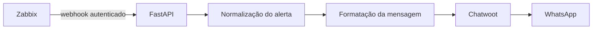
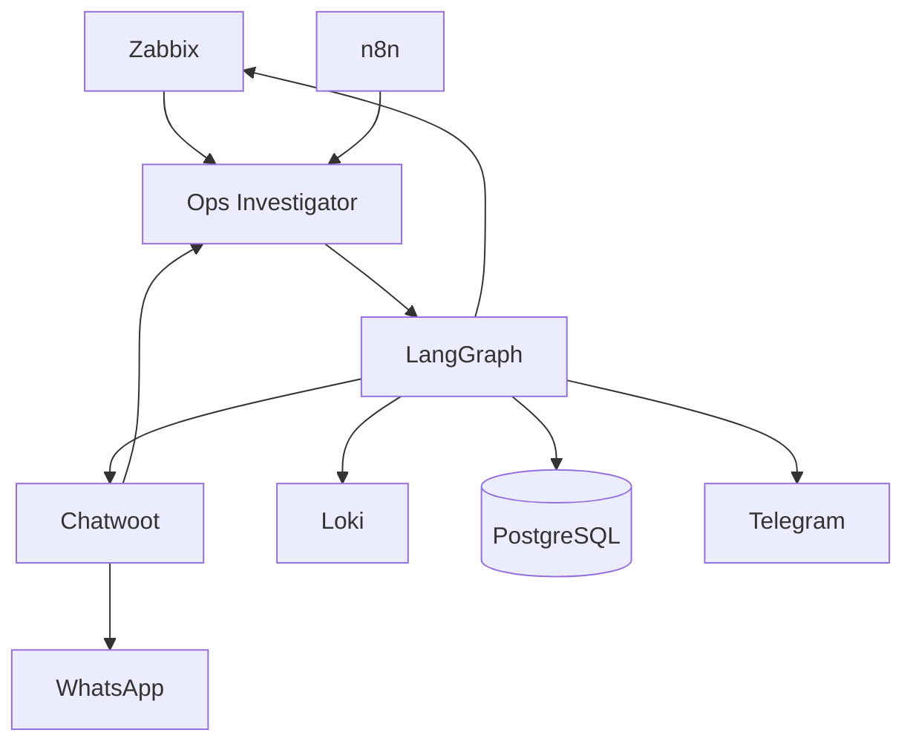

<!-- generated-by: gsd-doc-writer -->
# Ops Investigator

POC de um agente que investiga incidentes em uma plataforma de atendimento, reúne evidências operacionais e transforma alertas técnicos em notificações objetivas para o WhatsApp.

## Sobre o projeto

A plataforma observada usa Chatwoot e UAZAPI para integrar o WhatsApp, um bridge entre os serviços e um agente de atendimento executado no n8n. A observabilidade existente inclui Zabbix, Grafana Loki, Portainer e Coolify.

O objetivo do Ops Investigator é reduzir o tempo entre um problema ser detectado e uma pessoa entender:

- qual serviço foi afetado;
- quais evidências foram encontradas;
- qual é a causa provável;
- o que deve ser verificado em seguida.

O projeto é somente investigativo: ele não reinicia containers, executa comandos ou altera produção.

## Estado atual

A primeira fatia da POC está implementada:

- API FastAPI com health check;
- webhook autenticado para alertas do Zabbix;
- validação e normalização do payload com Pydantic;
- formatação de uma notificação operacional;
- envio para uma conversa do Chatwoot;
- modo seguro que processa alertas sem realizar envios externos;
- Dockerfile para empacotamento da aplicação;
- testes automatizados do health check e do webhook.

O LangGraph, a busca de logs no Loki, a persistência em PostgreSQL e a detecção de conversas sem resposta fazem parte dos próximos incrementos.

## Fluxo implementado

Quando `CHATWOOT_ENABLED=false`, todo o fluxo é executado até a etapa de envio, que retorna o status `skipped`.

## Arquitetura planejada

Os detectores determinísticos identificarão o incidente. O LangGraph será responsável por coletar evidências, formular hipóteses e assumir uma conclusão inconclusiva quando os dados não forem suficientes.

## Tecnologias

| Tecnologia | Uso |
|---|---|
| Python 3.12 | Runtime da aplicação |
| FastAPI | API e recebimento de webhooks |
| Pydantic Settings | Configuração e validação |
| HTTPX | Integração HTTP com o Chatwoot |
| Pytest | Testes automatizados |
| Docker | Empacotamento para o Coolify |
| LangGraph | Orquestração da investigação, planejada |
| PostgreSQL | Persistência de incidentes, planejada |

